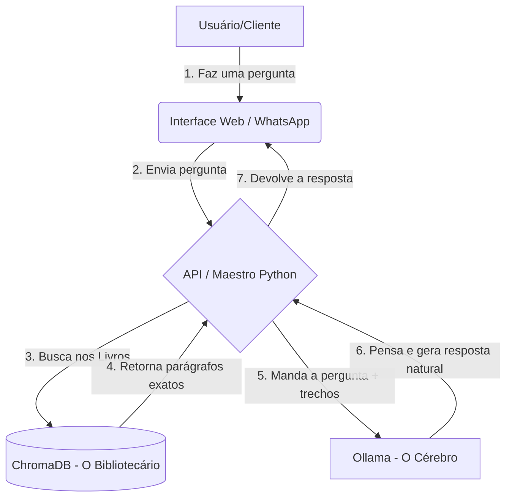

# Por Dentro do Seguros Cloud IO: Como o nosso Cérebro Digital Funciona

## Visão Geral
O **Seguros Cloud IO** não é um chatbot comum que usa respostas prontas. Ele é um sistema de **Inteligência Artificial (IA)** desenhado para atuar como um especialista de seguros. 

Para que tudo funcione perfeitamente, o sistema foi dividido em três grandes camadas:
1. **O Balcão de Atendimento (Interface do Chat)**
2. **O Pesquisador e a Biblioteca (A Memória do Sistema)**
3. **O Cérebro Especialista (A Inteligência Artificial)**

Veja no mapa visual abaixo como essas três partes conversam entre si:

---

## Entendendo as Peças do Quebra-Cabeça (Analogias Simples)

### 1. O Balcão de Atendimento (Interface Web)
É a tela escura e elegante que você vê no site ou no Botpress. 
* **O que faz:** Recebe a dúvida do cliente e mostra a resposta final em uma caixa de bate-papo familiar.
* **A Analogia:** Imagine que é o balcão da seguradora. O cliente chega aqui, fala com a recepcionista (Interface Web) e a recepcionista leva a pergunta anotada lá para a sala dos fundos (onde fica a equipe técnica).

### 2. O Pesquisador e a Biblioteca (RAG e ChromaDB)
Aqui está o segredo para a IA nunca "alucinar" (inventar respostas mentirosas).
* **O que faz:** Sempre que você pergunta algo, o sistema (RAG) consulta um banco de dados especial (ChromaDB) onde guardamos centenas de PDFs, regras e manuais de seguros. Ele seleciona apenas os 4 parágrafos mais relevantes que tenham relação com a sua dúvida.
* **A Analogia:** Imagine um bibliotecário ultrarrápido. Você pergunta *"Meu parabrisa trincou"*, ele corre na imensa biblioteca, pega 4 manuais que falam de "quebra de vidro", abre na página exata e entrega na mão do "Cérebro".

### 3. O Cérebro Especialista (Ollama LLM)
Esta é a verdadeira Inteligência Artificial.
* **O que faz:** Ele recebe a pergunta do usuário e os 4 parágrafos que o Bibliotecário encontrou. O Cérebro então lê as regras, raciocina sobre elas e formula uma resposta educada e natural, como se fosse um ser humano.
* **A Analogia:** É o "Advogado Especialista". Ele é super inteligente, sabe conversar bem, mas ele **só tem permissão para responder** se olhar as páginas que o Bibliotecário trouxe para ele. Se as páginas não contiverem a resposta para a dúvida, ele é estritamente treinado para dizer: *"Não tenho certeza, vou te passar para um humano"*.

---

## Guia Rápido: Como Usar o Sistema

Seja você um corretor testando a ferramenta ou um cliente final, usar o Seguros Cloud IO é extremamente simples:

### Passo 1: Acesse o Chat
Abra a página principal do sistema na web. Você verá a interface de chat com uma mensagem de boas-vindas do nosso assistente virtual.

### Passo 2: Faça sua Pergunta (seja específico)
Para obter os melhores resultados do "Cérebro", tente fazer perguntas completas, informando o contexto do seu seguro.
* **❌ Ruim:** *"quebra"*
* **✅ Bom:** *"O meu seguro auto premium cobre quebra de farol e lanterna?"*
* **✅ Bom:** *"Quais são as coberturas básicas do seguro de vida?"*

### Passo 3: Aguarde a Resposta
Você verá a indicação de que o bot está "digitando...". Nesses breves segundos, ele está fazendo toda aquela jornada do diagrama acima (buscando na biblioteca e raciocinando). Em seguida, a resposta polida e precisa aparecerá na tela.

### O que fazer se a IA disser que não sabe?
Se a IA retornar uma mensagem como: *"Desculpe, não encontrei essa informação com segurança. Vou encaminhar você para um especialista humano."*

**Fique tranquilo, isso não é um erro do sistema!** É o nosso principal mecanismo de segurança entrando em ação. Isso significa que a resposta para a sua pergunta não está escrita em nenhum dos PDFs e manuais que alimentamos na memória do robô. Nesse caso, ele prefere assumir que não sabe e passar a bola para um funcionário de carne e osso, em vez de inventar uma cobertura que a seguradora não oferece!
